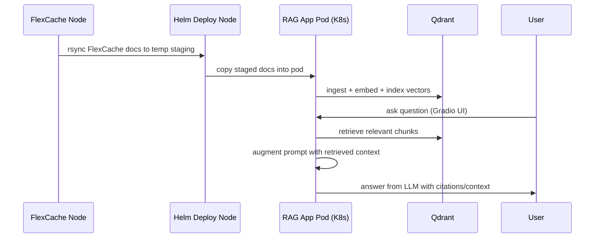

# Build Guide: Deploy “Chat with Your Documents” on AMD AIMs Platform (RAG + Qdrant + ONTAP FlexCache)

## Table of Contents

1. [Overview](#overview)
2. [Target Architecture](#target-architecture)
3. [Prerequisites](#prerequisites)
4. [Workflow Summary](#workflow-summary)
5. [Step 1 — Mount & Sync ONTAP FlexCache Documents](#step-1--mount--sync-ontap-flexcache-documents)
6. [Step 2 — Deploy Qdrant with Docker](#step-2--deploy-qdrant-with-docker)
7. [Step 3 — Password-less SSH Access to FlexCache Node](#step-3--password-less-ssh-access-to-flexcache-node)
8. [Step 4 — Deploy AMD AIMs Kubernetes Platform Using Bloom](#step-4--deploy-amd-aims-kubernetes-platform-using-bloom)
9. [Step 5 — Configure Self-Signed TLS for nip.io](#step-5--configure-self-signed-tls-for-nipio)
10. [Step 6 — Deploy “Chat with Your Documents” Helm App](#step-6--deploy-chat-with-your-documents-helm-app)
11. [Step 7 — Validate & Access the Gradio UI](#step-7--validate--access-the-gradio-ui)
12. [Troubleshooting Checklist](#troubleshooting-checklist)
13. [Conclusion](#conclusion)

---

## Overview

This guide deploys a **Document Chat (RAG) application** on the **AMD AIMs platform**, using:

* **ONTAP FlexCache** for document storage (mounted on a separate node or site)
* **Qdrant** as the vector database
* **Embedding model** to convert documents into vectors
* **LLM (AIM)** to answer questions using retrieved context
* **Helm-based deployment** of the “Talk to Your Documents” blueprint app

---

## Target Architecture

### RAG High-Level Architecture (Recommended)

---

## Prerequisites

### Infrastructure

* AMD AIMs Kubernetes cluster (or planned installation via Bloom)
* A GPU node (e.g., MI325X / MI300X-class depending on your deployment)
* A reachable host running **ONTAP FlexCache** mount point (may be a different node than K8s worker)

### Access & Networking

* SSH access to:

  * **Helm deployment node**
  * **FlexCache mount node**
  * **Kubernetes control plane**
* Firewall rules allowing:

  * App ingress HTTPS (443)
  * Qdrant ports (6333/6334) if accessed externally (recommended to keep internal)

### Tools

* `kubectl`, `helm`, `git`, `ssh`, `rsync`
* Docker installed on the Qdrant host (if running Qdrant outside K8s)

---

## Workflow Summary



---

## Step 1 — Mount & Sync ONTAP FlexCache Documents

### What happens

* FlexCache mount is synchronized to a **temporary staging directory** using `rsync`
* Staged documents are copied to the **RAG app pod**
* Documents are ingested and indexed into **Qdrant**

### Recommended best practices

* Keep documents **read-only** from the app side
* Use a dedicated staging directory (e.g., `/tmp/flexcache-sync`)
* Ensure predictable file types (PDF, TXT, MD, DOCX) per your ingestion pipeline


## Step 2 — Deploy Qdrant with Docker

> **Security note:** If possible, keep Qdrant **private** (cluster-internal) and avoid exposing it on a public IP. If you must expose it, restrict via firewall/IP allowlist.

### 2.1 Pull the Qdrant Image

```bash
docker pull qdrant/qdrant
```

### 2.2 Create Persistent Storage Directory

```bash
mkdir -p ~/qdrant/storage
```

Stores: vectors, collections, snapshots, metadata.

### 2.3 Run Qdrant Container

```bash
docker run -d \
  --name qdrant \
  -p 6333:6333 \
  -p 6334:6334 \
  -v ~/qdrant/storage:/qdrant/storage \
  --restart unless-stopped \
  qdrant/qdrant
```

### 2.4 Verify Container

```bash
docker ps
```

Expected ports:

* `0.0.0.0:6333->6333/tcp`
* `0.0.0.0:6334->6334/tcp`

### 2.5 Test API

Local:

```bash
curl http://localhost:6333
```

Remote:

```bash
curl http://<QDRANT_PUBLIC_IP>:6333
```

Expected:

```json
{"title":"qdrant - vector search engine"}
```

### 2.6 Open Firewall Ports (If Required)

```bash
sudo iptables -I INPUT -p tcp --dport 6333 -j ACCEPT
sudo iptables -I INPUT -p tcp --dport 6334 -j ACCEPT
sudo iptables -L
```

### 2.7 Health Check

```bash
curl http://<QDRANT_IP>:6333/health
```

Expected:

```json
{"status":"ok"}
```

### 2.8 Create a Test Collection (Example)

```bash
curl -X PUT http://<QDRANT_IP>:6333/collections/test_collection \
  -H "Content-Type: application/json" \
  -d '{
    "vectors": { "size": 384, "distance": "Cosine" }
  }'
```

---

## Step 3 — Password-less SSH Access to FlexCache Node

This enables `deploy.sh` to automatically sync documents from the FlexCache node.

### 3.1 Add SSH Host Alias

Create/update `~/.ssh/config` on the **Helm deployment node**:

```sshconfig
Host flex
  HostName <FLEXCACHE_NODE_IP>
  User <FLEXCACHE_USERNAME>
```

### 3.2 Copy SSH Key

```bash
ssh-copy-id flex
```

### 3.3 Test Access

```bash
ssh flex "hostname && whoami"
```

---

## Step 4 — Deploy AMD AIMs Kubernetes Platform Using Bloom

### 4.1 Download Bloom

```bash
wget https://github.com/silogen/cluster-bloom/releases/download/v1.2.2/bloom
chmod +x bloom
```

### 4.2 Create `bloom.yaml`

```bash
nano bloom.yaml
```

Example (sanitize and replace placeholders):

```yaml
DOMAIN: <YOUR_DOMAIN>
OIDC_URL: https://kc.<YOUR_DOMAIN>/realms/airm
FIRST_NODE: true
GPU_NODE: true
CERT_OPTION: generate
USE_CERT_MANAGER: true
CLUSTER_DISKS: </dev/your_disk_or_partition>
CLUSTERFORGE_RELEASE: <CLUSTERFORGE_RELEASE_TARBALL_URL>
NO_DISKS_FOR_CLUSTER: false
```

### 4.3 Run Bloom Installer UI

```bash
sudo ./bloom --config bloom.yaml
```

Bloom will launch a local UI:

* `http://127.0.0.1:<PORT>`

### 4.4 SSH Tunnel to Access UI

```bash
ssh -L 62078:127.0.0.1:62078 <USER>@<SERVER_IP>
```

#### Screenshots (Uniform Size + Captions)

Use consistent width for all UI screenshots (example: **900px**).

**Figure 2 — Bloom Installer UI via SSH Tunnel** 

**Figure 3 — Configuration Review Screen** 

**Figure 4 — Cluster Components / Node Roles** 

**Figure 5 — Deployment Progress / Task Execution** 

**Figure 6 — Post-Install Summary / Success Screen** 

**Figure 7 — Platform Dashboard / Services Ready** 

**Figure 8 — Gateway / Ingress Service Status** 

---

## Step 5 — Configure Self-Signed TLS for nip.io

Create a wildcard TLS cert for:

* `*.<PUBLIC_IP>.nip.io`
* `<PUBLIC_IP>.nip.io`

### 5.1 Generate Certificate

```bash
cat > /tmp/airm-nipio-openssl.cnf <<'CNF'
[req]
default_bits = 2048
prompt = no
default_md = sha256
x509_extensions = v3_req
distinguished_name = dn

[dn]
CN = *.<PUBLIC_IP>.nip.io

[v3_req]
subjectAltName = @alt_names

[alt_names]
DNS.1 = *.<PUBLIC_IP>.nip.io
DNS.2 = <PUBLIC_IP>.nip.io
CNF

openssl req -x509 -nodes -days 365 -newkey rsa:2048 \
  -keyout /tmp/cluster-tls.key \
  -out /tmp/cluster-tls.crt \
  -config /tmp/airm-nipio-openssl.cnf
```

### 5.2 Install as Kubernetes Secret

```bash
kubectl -n kgateway-system create secret tls cluster-tls \
  --cert=/tmp/cluster-tls.crt \
  --key=/tmp/cluster-tls.key
```

---

## Step 6 — Deploy “Chat with Your Documents” Helm App

### Images and Models

* **LLM (AIM image)**: `amdenterpriseai/aim-meta-llama-llama-3-3-70b-instruct:0.8.5-preview`

  * Model: `llama-3-3-70b-instruct`
* **Embedding (Infinity image)**: `michaelf34/infinity:0.0.70-amd-gfx942`

  * Model: `intfloat/multilingual-e5-large-instruct`

> You can customize deployment via `values.yaml`.

### 6.1 Clone Repo

```bash
git clone git@github.com:KrArunT/aims.git
cd aims/talk-to-your-documents_vdb_q_llama3.3-70b
```

### 6.2 Deploy

```bash
./deploy.sh \
  --flex-docs-path /mnt/Flexcache_Site2 \
  --gateway-host my-rag-app.<AIMS_PLATFORM_PUBLIC_IP>.nip.io \
  --qdrant-url http://<QDRANT_IP>:6333/
```

#### Screenshots (Uniform Size + Captions)

**Figure 9 — Helm Deployment Output (Install/Upgrade)** 

**Figure 10 — Application Pods and Services Created** 

**Figure 11 — Ingestion / Indexing Log Snippet** 

**Figure 12 — Verify Deployment Status** 

---

## Step 7 — Validate & Access the Gradio UI

Once deployed, open:

* `https://my-rag-app.<PUBLIC_IP>.nip.io/`

**Figure 13 — Gradio UI Home** 

**Figure 14 — Upload/Select Documents** 

**Figure 15 — Ask Question and Retrieve Context** 

**Figure 16 — Answer Generation** 

---

## Troubleshooting Checklist

### Qdrant

* `curl http://<QDRANT_IP>:6333/health` returns `ok`
* Qdrant storage path exists and is writable
* Ports are not blocked by firewall/security group

### FlexCache / rsync

* `ssh flex` works without password
* `rsync` is installed on both sides
* Mount path exists and contains files: `ls -lah /mnt/Flexcache_Site2`

### Kubernetes / App

* `kubectl get pods -A | grep rag` shows pods running
* Gateway is reachable (DNS/nip.io resolves to correct IP)
* TLS secret exists: `kubectl -n kgateway-system get secret cluster-tls`

---

## Conclusion

You now have a working **RAG-based “Chat with Your Documents”** deployment on AMD AIMs, backed by:

* **ONTAP FlexCache** for document storage
* **Qdrant** for vector search
* **Embedding + LLM inference services** for retrieval-augmented answering


