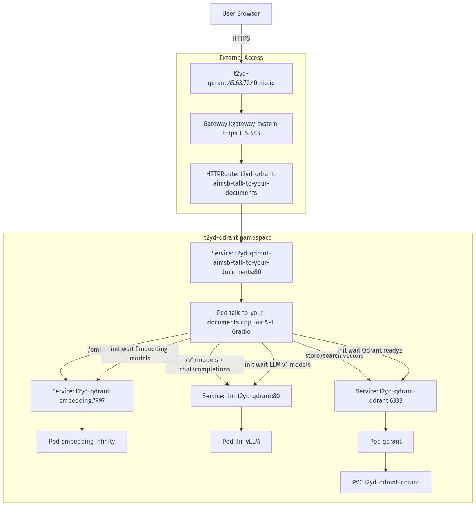

<!--
Copyright © Advanced Micro Devices, Inc., or its affiliates.

SPDX-License-Identifier: MIT
-->

# Talk to your documents: Architecture and End-to-End Kubernetes Deployment

This guide is the canonical reference for:
- Application architecture
- Deployment architecture on Kubernetes
- End-to-end deployment and verification flow

## Architecture Diagram



Source diagram: `architecture-deployment.mmd`

## Application Architecture

The app is a Retrieval-Augmented Generation (RAG) system with these components:
- **UI/API app** (`FastAPI + Gradio`): Upload files, ask questions, orchestrate retrieval and generation.
- **Embedding service** (Infinity): Converts document chunks and user queries into vectors.
- **Qdrant**: Stores embeddings and supports nearest-neighbor retrieval.
- **LLM service** (AIM/vLLM): Generates final answers using retrieved context.

### Runtime flow
1. User uploads `.pdf` or `.txt` documents.
2. App extracts content and chunks text (`CHUNK_SIZE`, `CHUNK_OVERLAP`).
3. App requests embeddings from embedding service.
4. App writes vectors and metadata to Qdrant collection (`rag_collection`).
5. User asks a question.
6. App embeds the query, retrieves top-k documents from Qdrant, and prompts the LLM.
7. App returns answer to the UI/API.

## Deployment Architecture on Kubernetes

Current chart deploys these key resources:
- `Deployment` + `Service`: talk-to-your-documents app
- `Deployment` + `Service`: embedding service
- `Deployment` + `Service`: LLM service
- `Deployment` + `Service` + `PVC`: Qdrant
- `HTTPRoute` (Gateway API): host-based external routing through existing `kgateway-system/https` Gateway

### Namespace and traffic path
- Workload namespace: `<namespace>`
- Gateway namespace: `kgateway-system`
- External host: `<release-name>.<gateway-ip>.nip.io`

Traffic:
`User -> Gateway(https) -> HTTPRoute -> app Service -> app Pod`

Internal service calls:
- app -> embedding service
- app -> LLM service
- app -> Qdrant service

## End-to-End Kubernetes Deployment Flow

Run from chart root directory:

```bash
cd solution-blueprints/talk-to-your-documents_vdb_qdrant
```

### 1) Prerequisites

- Kubernetes cluster access
- Helm and kubectl configured
- AMD GPU-capable nodes for LLM/embedding workloads
- Hugging Face token in `.env`:

```bash
HF_TOKEN=hf_xxx
```

### 2) Create required secret

```bash
release_name=my-rag-app
namespace=my-namespace
set -a && source .env && set +a
kubectl create namespace "$namespace" --dry-run=client -o yaml | kubectl apply -f -
kubectl -n "$namespace" create secret generic hf-token \
  --from-literal=hf-token="$HF_TOKEN" \
  --dry-run=client -o yaml | kubectl apply -f -
```

### 3) Deploy chart

```bash
helm dependency update .
helm upgrade --install "$release_name" . -n "$namespace"
```

### 4) Verify workloads

```bash
kubectl -n "$namespace" get deploy,pods,svc,pvc
kubectl -n "$namespace" get httproute
kubectl -n kgateway-system get gateway https
```

Expected:
- app, embedding, llm, qdrant Deployments become `READY`
- `hf-token` secret exists
- `HTTPRoute` is accepted and references Gateway `https`
- route hostname matches `<release-name>.<gateway-ip>.nip.io`

### 5) Verify endpoint

Primary endpoint:

```text
https://<release-name>.<gateway-ip>.nip.io
```

Health check:

```bash
curl -k "https://${release_name}.${gateway_ip}.nip.io/health"
```

Expected response:

```json
{"status":"ok"}
```

## Troubleshooting

### LLM pod stuck in `CreateContainerConfigError`
- Cause: missing `hf-token` secret
- Fix: recreate secret from `.env` and restart deployment

### App pod stuck in init container
- Cause: backend services not yet ready
- Check init logs:
```bash
kubectl -n "$namespace" logs deploy/"$release_name"-aimsb-talk-to-your-documents -c wait-for-dependencies
```

### External route not reachable
- Confirm HTTPRoute accepted:
```bash
kubectl -n "$namespace" get httproute "$release_name"-aimsb-talk-to-your-documents -o yaml
```
- Confirm Gateway listener and address:
```bash
kubectl -n kgateway-system get gateway https -o yaml
```

## Regenerating the Architecture Image

Preferred:

```bash
mmdc -i docs/architecture-deployment.mmd -o docs/architecture-deployment.png
```

Fallback via remote renderer (Kroki):

```bash
curl -fsSL -H 'Content-Type: text/plain' \
  --data-binary @docs/architecture-deployment.mmd \
  https://kroki.io/mermaid/png \
  -o docs/architecture-deployment.png
```
